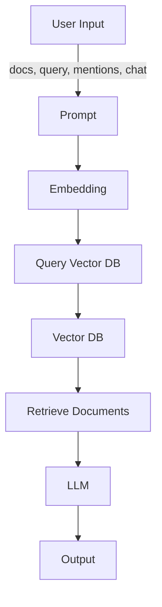
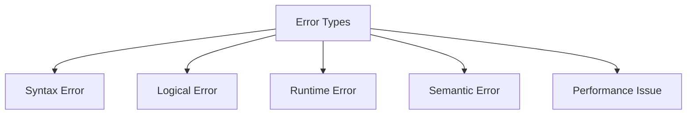

# Oakie Technologies AI Assistant

This AI assistant was built to help developers adhere to Oakie Technologies' coding guidelines and best practices. By integrating with the OpenAI API, I provide targeted answers, troubleshooting, and code advice tailored to Oakie’s standards.

## Overview

This assistant is designed to offer:
- Custom-tailored responses based on Oakie Technologies' guidelines.
- Support for multiple programming languages, including Python and JavaScript.
- Document context integration for more informed responses (text documents).
- A memory of past conversations with the ability to reset when needed.
- Reference capabilities for previous messages using mentions.
- A command-line interface (CLI) with both interactive and non-interactive modes.
- Conversation logging for future reference.

## System Architecture

To visualize how different components interact, here's a high-level system architecture diagram:



## Explanation
User Input: The system receives documents, query, mentions, and chat as input.
Prompt: The input is formatted into a prompt using predefined templates.
Embedding: The system uses embeddings (e.g., OpenAI's GPT-4 embeddings) to convert text into numerical vectors.
RAG (Retrieval-Augmented Generation): The system retrieves relevant information from the vector database.
LLM (Large Language Model): The system uses a large language model (e.g., GPT-4) to generate responses based on the retrieved information.
Vector DB: The system stores and retrieves embeddings in a vector database.
Output: The system provides the final response to the user.

## Features

- **Guideline Compliance:** Ensures responses adhere to Oakie Technologies' coding standards.
- **Language Support:** Provides coding best practices for Python and JavaScript.
- **Document Context Awareness:** Integrates uploaded documents into responses.
- **Conversation Memory:** Tracks discussions with reset capability.
- **PDF Support:** Parses and references PDFs for enriched responses.
- **CLI Access:** Allows for interactive and non-interactive usage.
- **Logging:** Stores conversations for future review and improvements.

## Setup

To get started with the assistant:

1. Clone this repository:
   ```sh
   git clone https://github.com/shlomtzi-hazan/shlomtzi-hazan/tree/main/MyAssistant
   cd MyAssistant
   ```
2. Install dependencies:
   ```sh
   pip install -r requirements.txt
   ```
3. Create a `.env` file with the following configuration:
   ```ini
   OPENAI_API_KEY=your_openai_api_key_here
   MODEL_NAME=gpt-4-turbo
   TEMPERATURE=0.7
   MAX_TOKENS=2000
   ENABLE_LOGGING=True
   LOG_PATH=logs/chat_logs.txt
   ```
4. Run the assistant:
   ```sh
   python main.py
   ```

## Configuration

### Key Files and Their Roles

| File | Description |
|------|-------------|
| `main.py` | Entry point for the AI assistant, handles queries and responses. |
| `chat_types.py` | Defines the data structures for conversations, messages, and roles. |
| `model.json` | Stores company guidelines, tech stack, and coding conventions. |
| `prompt.jinja2` | Template used to format system prompts. |
| `.env` | Contains environment variables like API keys and model settings. |
| `logs/chat_logs.txt` | Stores conversation logs for future reference. |
| `prompt_engineering/evaluation.py` | Evaluates response quality and accuracy. |

## Usage

### Interactive Mode

To start the interactive assistant:
```sh
python main.py
```

Available commands:
- **Type normally** to ask questions.
- **`exit`** to quit.
- **`reset`** to clear conversation history.
- **`/doc filename.py`** to load a document for context.
- **`/docs`** to list loaded documents.
- **`/cleardocs`** to remove all documents.

### Enhanced Mode

Advanced functionalities include:
- **Role-based customization** (e.g., `technical_advisor`, `code_reviewer`, `debugger`).
- **Automated response validation** for quality improvement.

```sh
python main.py --enhanced
```

## Error Types and Debugging Process

To ensure accuracy, I categorize errors into several types:



When investigating an issue, I follow this process:
1. **Gather Information** (Query, response, expected answer, logs).
2. **Analyze Context** (Check history, documents, system prompt).
3. **Verify Against Sources** (Compare with `model.json` and official references).
4. **Identify Root Cause** (Classify error type).
5. **Reproduce the Issue** (Create test cases).
6. **Implement Fix** (Update prompts, settings, or knowledge base).
7. **Verify and Communicate** (Test fix and update users).

## Automated Testing and Validation

To maintain high accuracy, I employ:
- **Unit Tests** for individual components.
- **Integration Tests** for system-wide checks.
- **Regression Tests** to prevent reintroduced errors.
- **Continuous Integration (CI)** to automate quality checks.
- **Automated Accuracy Validation** with predefined query-answer sets.

### Running Tests

To test the assistant:
```sh
python prompt_engineering/evaluation.py
```

Options:
```sh
--enhanced    # Uses the enhanced assistant
--test-file   # Custom test cases
--output      # Specify output path for the report
--threshold   # Set minimum passing score (default: 0.7)
```

## Evaluation System and Test Results

The evaluation system assesses the quality and accuracy of the assistant's responses. It uses predefined test cases and compares the actual output with the expected output (golden output). The system calculates scores based on various metrics and determines if the responses meet the required threshold.

### Evaluation Results
 - Tests Passed: 4/6 (66.7%)
 - Average Score: 0.719

## Contributing

Contributions are welcome! Follow these steps:
1. **Fork the repository.**
2. **Create a feature branch.**
3. **Implement changes.**
4. **Run tests (`python prompt_engineering/evaluation.py`).**
5. **Submit a pull request.**

