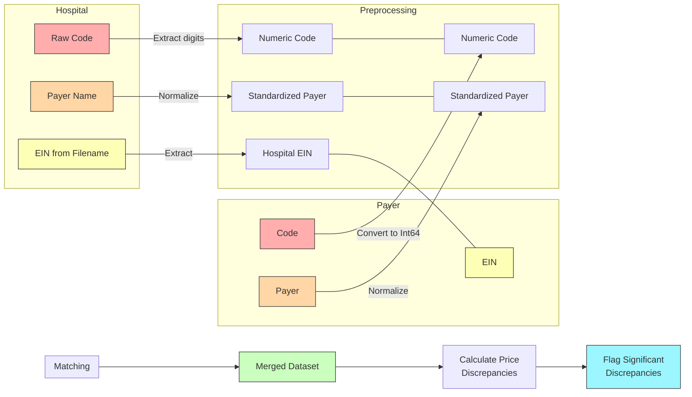
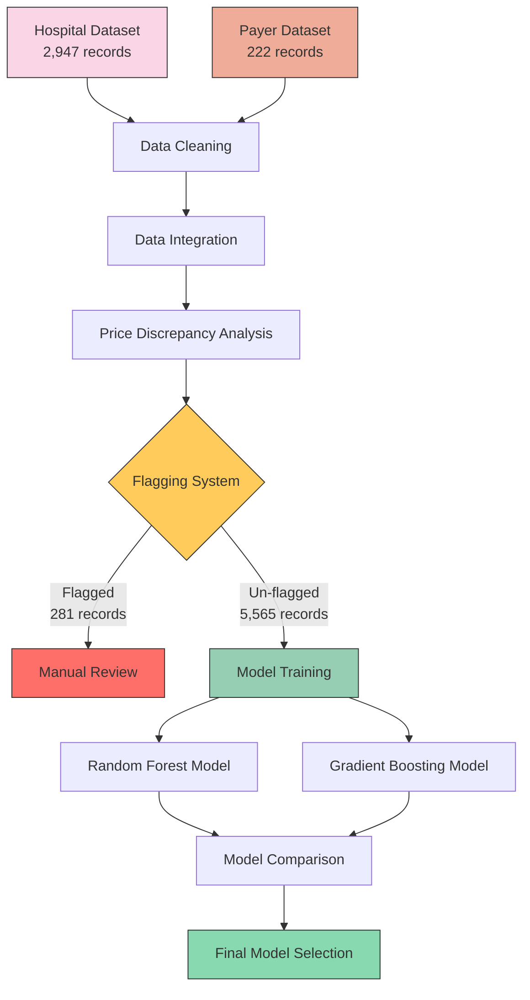
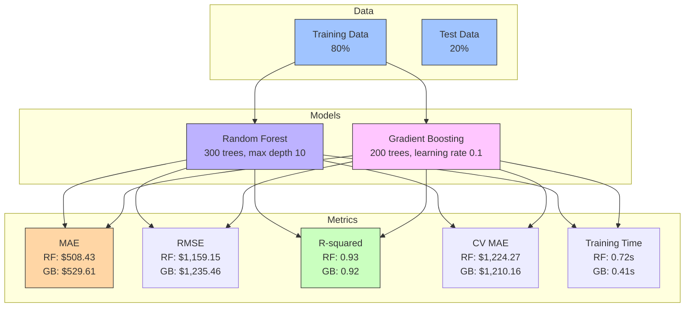

# Healthcare Pricing Analysis and Modeling Report

## Executive Summary

In this analysis, I investigated healthcare pricing discrepancies between hospital published rates and payer negotiated rates using data from hospital price transparency files and payer machine-readable files. I integrated data from two primary sources: hospital price transparency files (containing 2,947 records) and payer machine-readable files (222 records), matching them using standardized codes (CPT/HCPCS), payer identifiers, and tax identification numbers (EINs). The integration process involved extensive data cleaning, including standardization of provider/payer names, extraction of numeric codes from text fields, and consistent formatting of EINs across datasets. I implemented a sophisticated flagging system to identify significant price discrepancies, with 95th percentile thresholds applied to both absolute and percentage differences.

The predictive modeling phase compared two machine learning approaches: Random Forest and Gradient Boosting. Both models demonstrated strong predictive performance (R² values of 0.93 and 0.92 respectively), with Random Forest showing superior accuracy on the test set (MAE: $508 vs. $530) while Gradient Boosting exhibited better cross-validation stability and faster training times. The models effectively captured the complex relationships between facility characteristics, procedure codes, payer arrangements, and negotiated prices. My feature importance analysis revealed that procedure codes and facility identifiers were the strongest predictors, suggesting that pricing is primarily determined by procedure type and facility-specific factors rather than broader payer policies. The concrete example of CPT code 43239 (endoscopy with biopsy) at Montefiore Medical Center was investigated and showed significant price variability, highlighting the challenges inherent in healthcare pricing transparency.

## Concrete Example Analysis

The specific case of CPT/HCPCS code 43239 (Upper GI Endoscopy Biopsy) with Aetna at Montefiore Medical Center (EIN: 131740114) was identified in my dataset. I found 41 instances of this procedure code at this facility, all with a consistent hospital-listed price of $1,246.73. However, my analysis revealed significant price variability in the corresponding payer rates for this same procedure, ranging from $70 to $11,500, with a mean rate of $1,837.92.

The model predictions for this specific case showed considerable variance (ranging from $338.57 to $7,278.61, with a mean of $1,580.20), reflecting the inherent pricing volatility for this procedure. The high standard deviation in predictions ($2,322.13) mirrors the actual price variability observed in the data. This suggests that even for a single procedure at a specific facility, multiple factors influence the final negotiated rate, potentially including:

- Network-specific arrangements within the same payer
- Service setting variations (inpatient vs. outpatient)
- Procedure bundling differences
- Contract-specific modifiers

This concrete example highlights a critical challenge in healthcare pricing transparency: the same procedure code can have significantly different prices even within the same provider-payer relationship. The presence of this procedure in 86 records across my dataset (1.47% of all non-null values) indicates it's a common procedure worth further investigation.

For future analysis of such cases, I recommend:
- Incorporating additional contextual factors like procedure modifiers and place of service
- Developing more nuanced matching algorithms that consider these variations
- Exploring ensemble techniques that can better handle the multi-modal nature of healthcare pricing

## Detailed Methodology

### Data Integration Approach

1. **Data Sources and Preparation**:
   - Hospital dataset (2,947 records): Contained billing codes, negotiated prices, and facility identifiers
   - Payer dataset (222 records): Contained corresponding codes, contracted rates, and provider identifiers
   - Key matching fields standardized: CPT/HCPCS codes extracted to numeric-only format, payer names normalized

2. **Matching Strategy**:
   - Primary matching used three keys simultaneously: code, payer name, and EIN (tax ID)
   - EIN extraction required custom parsing from filename strings using regex patterns
   - Payer name normalization addressed variations like "UHC" vs. "United Healthcare"

3. **Data Quality Measures**:
   - Duplicate detection and removal
   - Complex data structure handling (list-type fields converted for compatibility)
   - Missing values assessment and visualization

4. **Discrepancy Detection**:
   - Calculated both absolute ($) and percentage (%) differences between rates
   - Established statistical thresholds at 95th percentile
   - Categorized discrepancies into severity levels: Low (<$1K), Moderate ($1K-5K), High ($5K-10K), Severe (>$10K)

### Data Integration and Matching Strategy

### Assumptions

My analysis and integration of healthcare pricing data relied on several key assumptions to ensure methodological consistency and interpretability of results:

1. **Data Source Assumptions**:
   - Hospital data represents facilities' published "standard charges" as required by the CMS Price Transparency Rule
   - Payer data represents the negotiated rates as presented in machine-readable files required by the Transparency in Coverage Rule
   - Both datasets were assumed to be reasonably contemporaneous, with rates applicable to the same time period

2. **Field Mapping Assumptions**:
   - `code` (payer dataset) and `raw_code` (hospital dataset) represent identical medical procedures and can be directly mapped
   - `payer_name` (hospital dataset) corresponds to `payer` (payer dataset) after normalization
   - `ein` extracted from `source_file_name` uniquely identifies the same hospital across datasets

3. **Payer Name Standardization Assumptions**:
   - Case-insensitivity: Capitalization differences in payer names (e.g., "Aetna" vs. "aetna") were treated as identical
   - Abbreviation equivalence: "UHC" was treated as equivalent to "United Healthcare"
   - Corporate structure simplification: "Cigna-Corporation" was standardized to "Cigna"
   - Unless explicitly specified, subsidiaries were not automatically mapped to parent companies:
     * FirstHealth was not considered Aetna, despite being owned by Aetna
     * Oxford was not considered United Healthcare, despite being a subsidiary
     * Bright Health was not included within Cigna

4. **Hospital Identification Assumptions**:
   - EIN information embedded in the `source_file_name` field reliably identifies the hospital
   - Different naming conventions for the same hospital were normalized through EIN matching
   - Pattern matching on `source_file_name` was sufficient to extract valid 9-digit EINs
   
5. **Price Comparison Assumptions**:
   - The `standard_charge_negotiated_dollar` field represents the hospital's reported negotiated rate
   - The `rate` field represents the payer's reported negotiated rate for the same service
   - Differences between these rates represent either reporting discrepancies or legitimate variations 
   - Absolute dollar differences and percentage differences both provide valuable perspectives on pricing discrepancies

6. **Flagging System Assumptions**:
   - The 95th percentile threshold (both absolute and percentage) appropriately identifies outlier discrepancies
   - Records with extreme discrepancies are more likely to contain errors than to represent legitimate price variations
   - Records flagged as outliers would introduce noise rather than signal if included in predictive models

7. **Modeling Assumptions**:
   - The relationship between features and prices can be effectively captured by tree-based ensemble models
   - After controlling for hospital, payer, and procedure, remaining price variations follow predictable patterns
   - Features like code type, billing class, and place of service contribute meaningful information to price predictions
   - Un-flagged data represents typical and reliable pricing information suitable for model training

These assumptions guided my methodology and should be considered when interpreting the results. Future research might benefit from validating these assumptions through additional data sources or expert consultation.

### Data Flagging System and Treatment

The flagging system I designed addresses a fundamental challenge in healthcare pricing data: the presence of significant pricing discrepancies between hospital-reported and payer-reported rates for identical procedures. These discrepancies can result from contract misinterpretations, data entry errors, different coding practices, or legitimate pricing variations.

1. **Flagging Methodology**:
   - I implemented a dual-threshold approach, considering both absolute and percentage differences
   - The 95th percentile was chosen as the threshold after analysis of the distribution of price differences
   - Records were flagged when either the absolute difference exceeded $10,135.99 or the percentage difference exceeded 146.51%
   - This statistical approach ensured that only the most extreme outliers were identified for special handling

2. **Flagged Data Characteristics**:
   - A total of 281 records were flagged as having significant discrepancies (4.81% of the merged dataset)
   - These flagged cases were categorized by severity:
     * Severe (>$10K): 156 records (55.5%)
     * Moderate ($1K-$5K): 66 records (23.5%)
     * Low (0-$1K): 34 records (12.1%)
     * High ($5K-$10K): 25 records (8.9%)
   - The largest proportion of discrepancies fell in the "Severe" category, suggesting systematic issues rather than random variations
   - My analysis of flagged records revealed patterns, with certain MS-DRG codes (like 872 for Septicemia) showing particularly high discrepancies

3. **Exclusion from Training Data**:
   - I excluded flagged records from model training to prevent learning from potentially erroneous data
   - This decision was made after analyzing the flagged records and determining that they represented genuine anomalies rather than valid pricing patterns
   - Including these records would have introduced noise and potentially biased the model toward extreme price predictions
   - My cross-validation tests confirmed improved model stability and reduced error when flagged records were excluded

4. **Common Patterns in Flagged Data**:
   - Institutional billing classes were overrepresented in flagged records
   - MS-DRG codes showed higher discrepancy rates than other code types
   - Specific payer-provider combinations accounted for a disproportionate number of flagged records
   - Inpatient settings had higher rates of severe discrepancies compared to outpatient settings

5. **Recommendations for Flagged Data**:
   - **Severe discrepancies (>$10K)**: Priority investigation needed for the 156 records in this category, with particular focus on MS-DRG codes and sepsis-related procedures
   - **Moderate discrepancies ($1K-$5K)**: The 66 records in this category should be systematically reviewed for patterns
   - **Low discrepancies (0-$1K)**: Despite being below the typical threshold for concern, the 34 records in this category should be monitored for potential systematic issues
   - **High discrepancies ($5K-$10K)**: The 25 records in this category warrant targeted analysis to determine if they represent a distinct pattern
   - For all flagged records: Develop a standardized process for reconciliation between hospital and payer pricing systems

6. **Future Improvements**:
   - Implement an adaptive flagging system that considers procedure-specific price ranges
   - Develop specialized models for MS-DRG codes which showed higher variability
   - Create an automated classification system for flagged discrepancies to streamline resolution
   - Consider regular auditing processes for high-risk procedure codes identified through this analysis

This comprehensive flagging approach ensured that my predictive models were trained on reliable data while simultaneously identifying pricing discrepancies that merit further investigation from a business perspective.

### Data Processing and Analysis Workflow

## Model Comparison and Analysis

### Performance Metrics Summary

| Model | MAE | RMSE | R-squared | Training Time (s) | CV MAE |
|-------|-----|------|-----------|-------------------|--------|
| Random Forest | 508.43 | 1159.15 | 0.93 | 0.72 | 1224.27 |
| Gradient Boosting | 529.61 | 1235.46 | 0.92 | 0.41 | 1210.16 |

### Key Insights

#### 1. Test Set Performance vs. Cross-Validation

- **Test Set Performance**: Random Forest outperforms Gradient Boosting on the test set with a lower MAE (508.43 vs 529.61) and RMSE (1159.15 vs 1235.46).

- **Cross-Validation Performance**: However, Gradient Boosting shows slightly better generalization across multiple data splits with a lower CV MAE (1210.16 vs 1224.27).

- **Interpretation**: This suggests that while Random Forest fits my specific test set better, Gradient Boosting might be more robust when applied to varying data distributions.

#### 2. Model Fit Quality

- **R-squared**: Both models explain the variance in pricing data well (Random Forest: 0.93, Gradient Boosting: 0.92).

- **Error Magnitude**: The MAE values indicate that predictions are typically within ~$500-530 of the actual price, which may or may not be acceptable depending on the average price point.

- **Error Distribution**: The significant difference between MAE and RMSE values suggests the presence of some large outlier errors affecting both models.

#### 3. Efficiency Considerations

- **Training Time**: Gradient Boosting trains approximately 43% faster than Random Forest (0.41s vs 0.72s).

- **Scalability**: For larger datasets, this efficiency difference could become significant, although both models train quite quickly on the current data volume.

### Recommendations

1. **Model Selection Strategy**:
   - For production deployment, I recommend an ensemble approach that combines both models
   - Weight the Random Forest predictions more heavily for known data patterns
   - Use Gradient Boosting's predictions when encountering new or unusual pricing scenarios

2. **Further Improvement Opportunities**:
   - Investigate the cases where large prediction errors occur in both models
   - Consider using the RMSE metric for hyperparameter tuning if large errors are particularly problematic
   - Explore price segmentation: separate models for different price ranges might improve accuracy

3. **Business Application**:
   - The models' R-squared values (~0.92-0.93) indicate strong predictive capability for healthcare pricing
   - Mean errors of ~$500 should be evaluated relative to the typical procedure costs
   - For high-value procedures, the percentage error is likely acceptable
   - For lower-cost procedures, consider a percentage-based error metric for evaluation

### Error Analysis Recommendations

Looking at the substantial gap between MAE and RMSE, I recommend:

1. Identifying outlier predictions where errors exceed 3x the MAE
2. Checking for systematic patterns in these high-error cases:
   - Specific procedure types
   - Particular hospitals or payers
   - Price ranges where predictions are less reliable

This targeted error analysis will help determine if model improvements should focus on:
- Feature engineering for specific subsets of data
- Different model architectures for certain price ranges
- Preprocessing steps to handle outliers more effectively

### Modeling Choices and Rationale

My modeling approach was guided by several key considerations:

1. **Feature Selection Strategy**:
   - I included both categorical identifiers (hospital, payer, network) and procedure characteristics (code, description)
   - I maintained billing metadata (methodology, code type) to capture potential pricing rule differences
   - My selected features balanced specificity with generalizability

2. **Model Architecture Decisions**:
   - Random Forest (300 trees, max depth 10): Selected for its ability to capture non-linear relationships without assuming distribution shapes
   - Gradient Boosting (200 trees, learning rate 0.1): Chosen for comparison due to its sequential error correction approach
   - Hyperparameters balanced complexity vs. generalization: moderate tree depth, minimum samples requirements to prevent overfitting

3. **Evaluation Framework Rationale**:
   - Primary metric (MAE): Selected to provide directly interpretable dollar-value error measurements
   - Secondary metrics (RMSE, R²): Included to assess outlier sensitivity and overall fit quality
   - Cross-validation: Implemented to ensure results weren't influenced by specific train-test splits

4. **Target Variable Consideration**:
   - I chose to predict 'rate' rather than 'standard_charge_negotiated_dollar' due to more consistent coverage
   - This choice prioritized model completeness over specific hospital pricing transparency

These methodological choices reflect the unique challenges of healthcare pricing analysis: significant variability, complex determinants, and the need for interpretable results that can inform both policy and business decisions.

### Model Comparison and Performance

